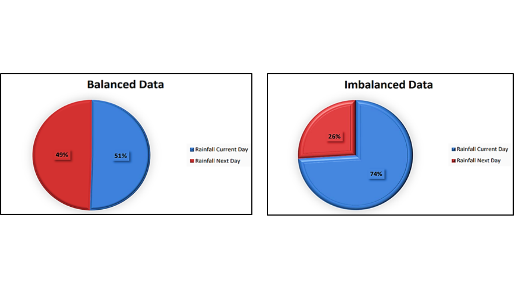
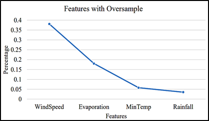
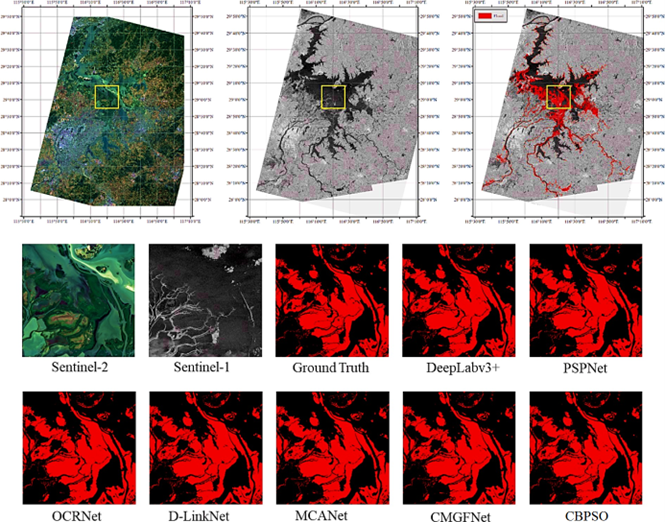

# Urban Flood Detection with Augmented Gradient Boosting and Machine Learning

## Overview
This repository implements an augmented gradient boosting approach using machine learning for efficient urban flood detection over vulnerable zones. The project is led by Dr. P. Preethi, Dr. R. Swathika, Shabana Urooj, and Mrs. K. Lalitha from reputable institutions in India and Saudi Arabia.

## Authors
- Dr. P. Preethi *(preethi1.infotech@gmail.com)*
- Dr. R. Swathika
- Shabana Urooj *(smurooj@pnu.edu.sa)*
- Mrs. K. Lalitha

## Abstract
Urban flooding poses a significant threat to ecosystems and human life. This project focuses on understanding and mitigating urban flooding by leveraging machine learning, specifically the XGBoost algorithm. The study introduces an enhanced extreme gradient boosting (XGBoost) approach based on a concatenated boosting particle swarm optimization (CBPSO) operator. The proposed method demonstrates improved accuracy in flood prediction compared to conventional techniques.

## Keywords
Flood prediction, concatenation, boosting, ensembling, IoU, flood-prone, multi-criteria.

## Table of Contents
1. [Introduction](#introduction)
2. [Methodology](#methodology)
3. [Results](#results)
4. [Conclusion](#conclusion)

## 1. Introduction 
Floods have been a destructive disaster affecting infrastructure, people, and property. Identifying flood-prone areas is crucial for effective policy development. This project employs both physically-based and data-driven approaches, utilizing machine learning models such as Decision Trees, Random Forest, Support Vector Machines, and the enhanced XGBoost algorithm.

 

## 2. Methodology 
The methodology involves collecting meteorological data from twenty-one stations in the Cuddalore district, Tamil Nadu, India. The dataset is pre-processed using Principal Component Analysis (PCA) to refine and reduce dimensions. The RandomForest algorithm is then employed for feature selection, and XGBoost is used for rainfall prediction, categorizing regions based on different levels of rainfall.

## 3. Results 
The study compares the prediction results of the enhanced XGBoost algorithm with backpropagation (BP) network and the original XGBoost method using evaluation criteria such as Accuracy, Precision, Recall, F1-score, and Intersection over Union (IoU). The model's IoU of 89.90% outperforms state-of-the-art flood detection systems.

## 4. Conclusion 
This repository presents an innovative approach to urban flood detection by augmenting the XGBoost algorithm. The proposed method demonstrates superior performance in predicting flood occurrences, providing a valuable tool for flood vulnerability assessments.

## Contact
For any inquiries or collaboration, please contact:
- Dr. P. Preethi: preethi1.infotech@gmail.com
- Shabana Urooj: smurooj@pnu.edu.sa
